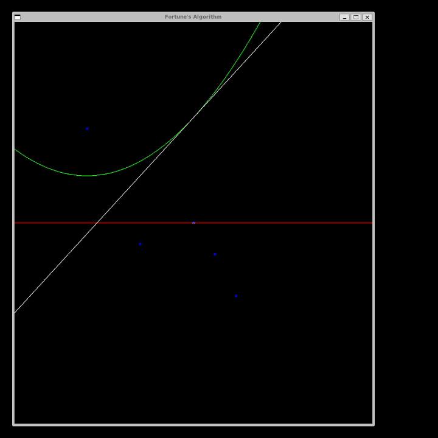
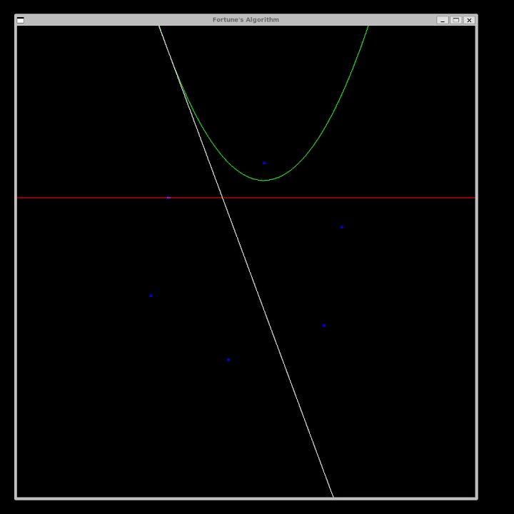
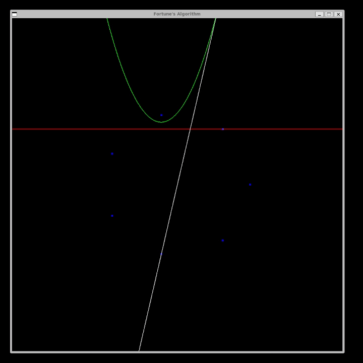
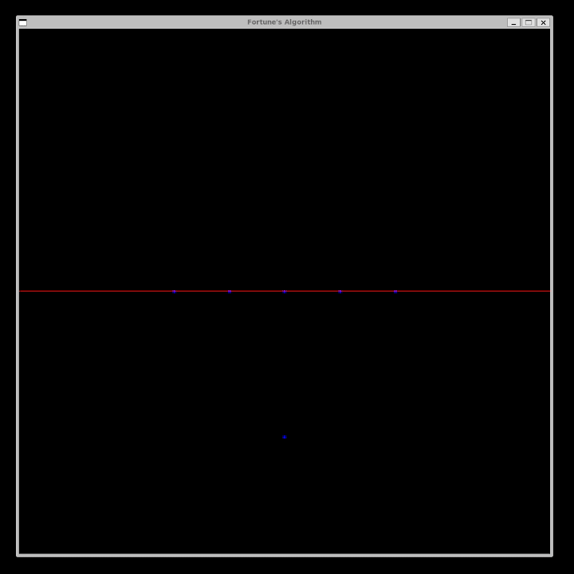
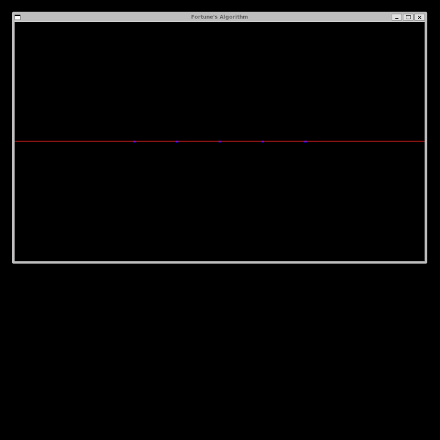

# Voronoi Diagram and Delaunay Triangulation Generator
This project is an implementation of Fortune's Algorithm for generating Voronoi Diagrams and Delaunay Triangulations. The project is written in C++. The project is a part of the course work for the course COM S 418 - Computational Geometry at Iowa State University.

 
*Generated test case 100 random points*

## Requirements
- C++ Compiler (g++)
- Make Utility (make)
- OpenGL Utility Toolkit (GLUT)

## Compilation
To compile the project, run make, or make all in the project directory. This will generate the executable file run.

Please note all testing was done in a WSL2 Linux environment (ubuntu 22.04.4 LTS) and the makefile was created for that environment. If you are using a different environment you may need to modify the makefile to work with your environment.

## Execution
To run the project, execute the run file generated by the make command. 

options:

    -na/-noAnimation: To run the project without OpenGL animation.

    {filename}: The name of the file containing the points to generate the Voronoi Diagram and Delaunay Triangulation. if not provided, the program will attempt to read the points from sites.txt file in the project directory.

## Output
The project generates 1 output file:

    - voronoi.txt: The file contains the Voronoi Diagram and Delaunay Triangulation in the form of Doubly Connected Edge Lists listings vertices, faces, and edges.

## Input
The input file sites.txt consists of multiple lines, each listing the coordinates of one or more point sites separated by blanks. For example, the following input file describes five point sites (2, -3), (-10, 9), (0, 0), (-5, -2), and (4, -7):

```txt
(2, -3) (-10, 9) (0, 0)
(-5, -2) (4, -7)
```

Points can be floating point numbers or integers. The program will read the points as floating point numbers.


## Controls
The Following controls run the OpenGL animation:

    - p/P: Pause/Resume the animation.
    - s/S: Step down the animation.
    - f/F: Auto finish the animation.
    
    - a/A: Toggles drawing arcs from the sites at the current sweep line.
    - e/E: Toggles drawing incomplete half edges.

    - q/Q: print out the current Event Queue.
    - l/L: print out the current Beach Line.

    - [/{ : increase the speed of the animation.
    - ]/} : decrease the speed of the animation.

The following controls are available after the animation is finished:

    - d/D: print out the current Voronoi Diagram as a DCEL.
    - x/X: print out the current Delaunay Triangulation as a DCEL.
    - c/C: display the current Voronoi Diagram using OpenGL.
    - v/V: display the current Delaunay Triangulation using OpenGL.


# My Provided Test Cases

In the folder labeled myTestCases I have provided 5 test cases that I have created (and 1 provided in class materials). The test cases are as follows:

1. provided.txt - uses the five points provided as an example source in the project description (integers)

2. hexagon.txt - uses 6 points in a hexagon shape (floats)

3. heptagon.txt - uses 7 points in a heptagon shape (floats)

4. 100Points.txt - is a random set of 100 points generated using a python script (integers)

5. 5colin1below.txt - 5 colinear points with one point below the line (integers)

6. 5colinear.txt - 5 colinear points (integers)


By default the program will read from sites.txt, but you can specify the file you want to read from by passing the filename as an argument when running the program. For example, to run the program with the hexagon.txt file you would run the following command:

./run myTestCases/hexagon.txt


## Test Case Visual Outputs

### provided.txt




### hexagon.txt




### heptagon.txt




### 100Points.txt


### 5colin1below.txt




### 5colinear.txt

